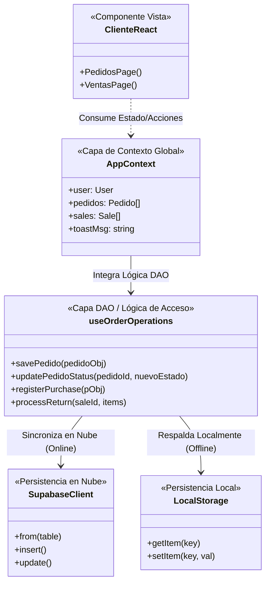
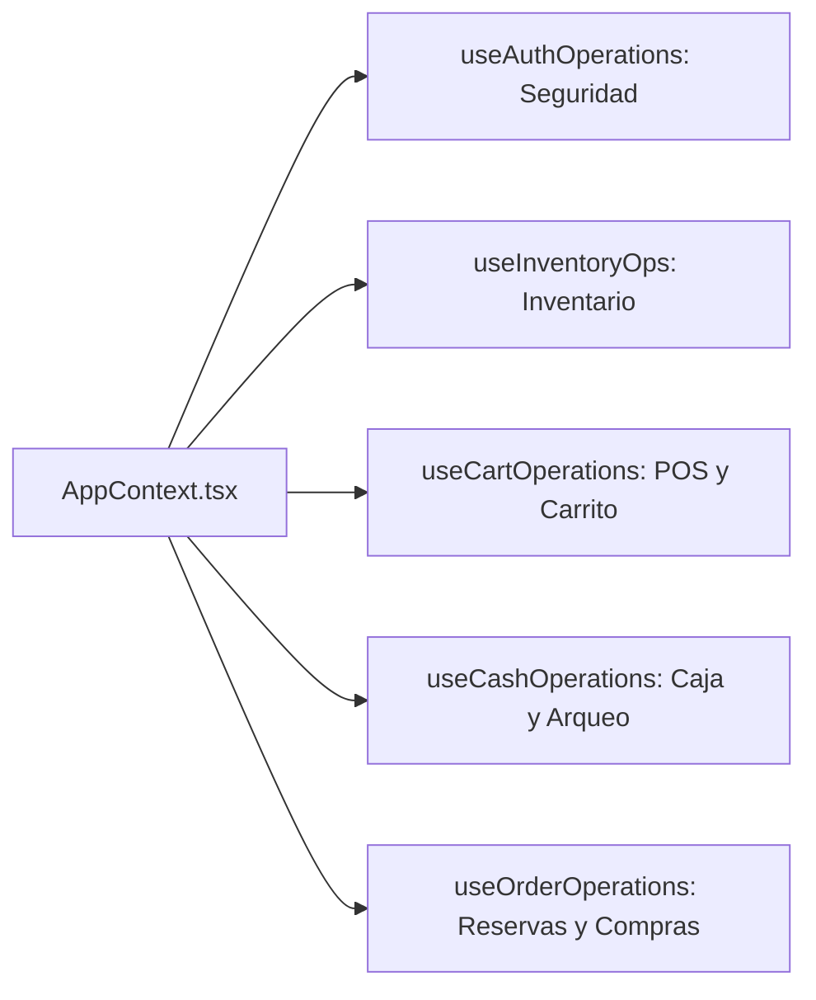

# Arquitectura del Proyecto - Panadería Prototipos

Este documento detalla la arquitectura técnica de la aplicación, mapeando las tecnologías modernas utilizadas (Next.js, TypeScript y Supabase) a los patrones de diseño clásicos exigidos por la rúbrica (**MVC**, **DAO** y **SOLID**). Puedes utilizar estos diagramas y explicaciones para tu informe y tus diapositivas de sustentación oral.

---

## 1. Arquitectura MVC (Modelo-Vista-Controlador)
En una aplicación web moderna orientada a componentes y API REST/Serverless, el patrón MVC se adapta de la siguiente manera:

* **Modelo (M)**: La base de datos relacional (PostgreSQL) alojada en Supabase y las definiciones de tipos TypeScript (`types.ts`) que modelan los datos de la panadería.
* **Vista (V)**: Páginas del Dashboard de administración (`src/app/dashboard/...`) escritas en React/TailwindCSS, que renderizan la interfaz para el usuario de manera interactiva.
* **Controlador (C)**: Rutas API (`src/app/api/...`) que manejan las peticiones del frontend, aplican validaciones de seguridad (como autenticación y DNI) y procesan la lógica del negocio.

```mermaid
graph TD
    subgraph VISTA (React Components)
        V[Dashboard Pages / POS / Caja]
    end

    subgraph CONTROLADOR (Next.js APIs & Hooks)
        C[API Routes /api/send-otp]
        H[Custom React Hooks: useOrderOperations]
    end

    subgraph MODELO (Data Layer)
        M_TS[Tipos de Datos TypeScript: types.ts]
        M_DB[(Supabase PostgreSQL Database)]
    end

    V -->|1. Interacción del Usuario / Eventos| H
    H -->|2. Envía Petición HTTP / Fetch| C
    C -->|3. Consulta / Escribe datos| M_DB
    M_DB -->|4. Retorna filas / JSON| C
    C -->|5. Retorna respuesta JSON| H
    H -->|6. Actualiza Estado React / Tipos| M_TS
    M_TS -->|7. Re-renderiza con nuevos datos| V
```

---

## 2. Implementación del Patrón DAO (Data Access Object)
El patrón DAO aísla la lógica de acceso a datos del comportamiento del negocio y la interfaz de usuario.
* En lugar de clases DAO clásicas de Java con JDBC/JPA, el proyecto encapsula el acceso a la persistencia (Supabase / LocalStorage) en **Hooks Personalizados de React**.
* Los componentes visuales (como `PedidosPage`) nunca hacen peticiones directamente a la base de datos; consumen las funciones expuestas por la capa de acceso a datos de los Hooks.



---

## 3. Principios SOLID Aplicados
En una arquitectura moderna basada en Hooks y TypeScript, los principios SOLID se evidencian en el diseño modular:

### A. SRP (Single Responsibility Principle - Principio de Responsabilidad Única)
La lógica de negocio y estado global no se concentran en un único archivo gigante. Cada módulo operativo tiene su propio Hook con una responsabilidad única y aislada:
* `useAuthOperations.ts`: Gestión exclusiva de sesiones y control de acceso.
* `useInventoryOps.ts`: Gestión del catálogo de panes, stock y kardex.
* `useCartOperations.ts`: Lógica del carrito de compras y POS.
* `useCashOperations.ts`: Control de flujo de dinero, turnos y arqueos de caja.
* `useOrderOperations.ts`: Gestión de reservas, compras de insumos y devoluciones.



### B. ISP (Interface Segregation Principle - Principio de Segregación de Interfaces)
Las interfaces de TypeScript en `src/context/types.ts` definen contratos de datos específicos y delgados para cada entidad en lugar de interfaces genéricas sobrecargadas. Cada componente o función importa únicamente el tipo que necesita utilizar.
* `Product` y `ProductVersion` están segregados para modelar productos estándar y variantes.
* `CashSession` e `HistoryRecord` separan la caja activa de la auditoría histórica.
